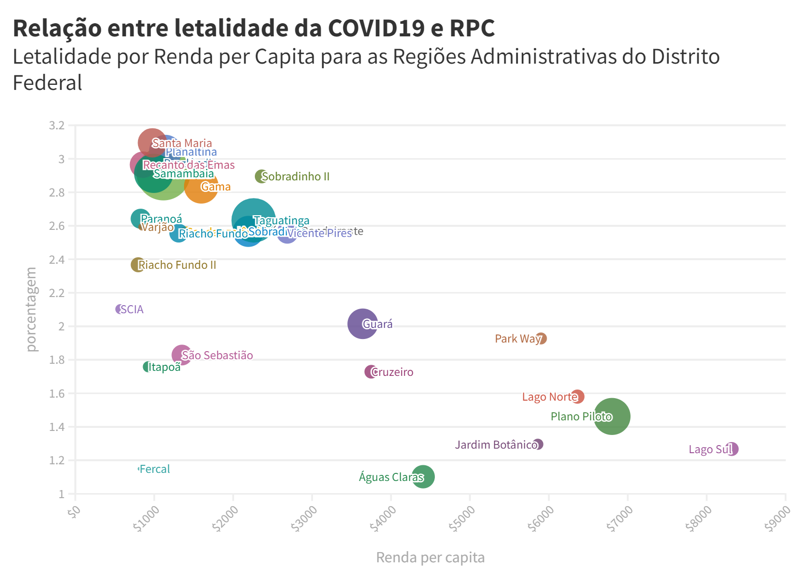

  

In this project we analyse data concerning **COVID-19 cases** and **mobility** in the Federal District of Brazil.

With the public health crisis caused by the COVID-19 pandemic, the prevention of its transmission is extremely important. Faced with these circumstances, several countries, including Brazil, started using social distancing and isolation of infected people as a method to reduce the infection. Such government interventions aims to reduce the mobility of the virus. Given these prevention measures, there is a correlation between the decrease in mobility and the rate of virus transmission. It is in our interest to better understand this correlation, since with the relaxation of the lockdown, many countries are experiencing new waves of infection.

# Lethality per GDP

  

